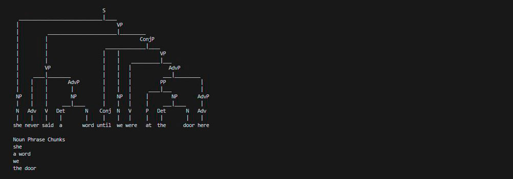

# Parser

## An AI to parse sentences and extract noun phrases

A common task in natural language processing is parsing, the process of determining the structure of a sentence. Knowing the structure of a sentence can help a computer to better understand the meaning of the sentence, and it can also help the computer extract information out of a sentence. In particular, it’s often useful to extract noun phrases out of a sentence to get an understanding for what the sentence is about.

In this project, we’ll use the **context-free grammar** formalism to parse English sentences to determine their structure. In a context-free grammar, we repeatedly apply rewriting rules to transform symbols into other symbols. The objective is to start with a **nonterminal symbol** `S` (representing a sentence) and repeatedly apply context-free grammar rules until we generate a complete sentence of **terminal symbols** (i.e., words). The rule `S -> N V`, for example, means that the `S` symbol can be rewritten as `N V` (a noun followed by a verb). If we also have the rule `N -> "Holmes"` and the rule `V -> "sat"`, we can generate the complete sentence "Holmes sat.".

Noun phrases and verbs phrases might not always be as simple as a single word like "Holmes" or "sat. We might have noun phrases like "my companion" or "a country walk" or "the day before Thursday", which require more complex rules to account for. To account for the phrase "my companion", for example, we might imagine a rule like: `NP -> N | Det N`. In this rule, we say that an NP (a “noun phrase”) could be either just a noun (`N`) or a determiner (`Det`) followed by a noun, where determiners include words like "a", "the", and "my". The vertical bar (`|`) just indicates that there are multiple possible ways to rewrite an `NP`, with each possible rewrite separated by a bar.

To incorporate this rule into how we parse a sentence (`S`), we need to modify the `S -> N V` rule to `S -> NP V`, to allow for noun phrases (`NP`s) as the subject of our sentence. To account for more complex types of noun phrases, we need more rules to complement the grammar even further. The more rules are implemented, the more complex sentences we can parse.

By defining this set of rules, the CYK algorithm, used by nltk's `parse`, is able to take a sentence (terminal symbols) and figure out the syntax tree (the structure of the non-terminal symbols).

According to how well the rules are established, this algorithm can detect non-well formed sentences, but it's incapable to detect some sentences that may not be semantically well-formed (non-sense sentences).

Since English grammar is inherently ambiguous, the same sentences can produce more than one syntax tree.

## Implementation

Each text file in the `sentences` directory contains an English sentence that our AI will parse.

In `parser.py`, the main function first accepts a sentence as input, either from a file or via user input. The sentence is preprocessed (via the `preprocess` function) and then parsed according to the context-free grammar defined by the file. The resulting trees are printed out, and all of the “noun phrase chunks” are printed as well (via the `np_chunk` function).

### Converting the input into a list of words

* The `preprocess` function accepts a sentence (a string) as input and return a lowercased list of its words.

* It uses nltk’s `word_tokenize` function to perform tokenization.

* Any word that doesn’t contain at least one alphabetic character (e.g. . or 28) is excluded from the returned list.

### Defining the context-free grammar rules

* The global variable `TERMINALS` generates terminal symbols. `Adj` is a nonterminal symbol that generates adjectives, `Adv` generates adverbs, `Conj` generates conjunctions, `Det` generates determiners, `N` generates nouns, `P` generates prepositions, and `V` generates verbs.

* The global variable `NONTERMINALS` generates nonterminal symbols. The first rule begin with `S ->` since `S` (representing a sentence) is the starting symbol. `NP` represents noun phrases, `VP` represents verb phrases, `AdjP` represents adjective phrases, `AdvP` represents adverb phrases, `PP` represents preposition phrases, and `ConjP` represents conjunctions phrases. 

* Each rule include the `->` characters to denote which symbol is being replaced, and may optionally include `|` symbols if there are multiple ways to rewrite a symbol.

* When combined both set of rules, we can parse of all sentences in the `sentences` directory.

**Some constraints:** 

* Avoid over-generation of sentences, sentences like "Armchair on the sat Holmes" aren't meant to be accepted by the parser.

* Avoid  under-generation of sentences. A very long and specific rule like `(S -> N V Det Adj Adj Adj N P Det N P Det N)` would technically successfully generate sentence 10, but isn't useful or generalizable.

* Try to be as general as possible without over-generating. The parser should accept the sentences: “Holmes sat in the armchair”, “Holmes sat in the red armchair” and “Holmes sat in the little red armchair”, but not the sentence: “Holmes sat in the the armchair”.

### Extracting the noun phrases

* The `np_chunk` function accepts a tree representing the syntax of a sentence (a `nltk.tree` object whose label is `S`) and return a list of all the noun phrase chunks in the sentence (a list of `nltk.tree` objects, where each element has the label `NP`).

* A noun phrase chunk is defined as a subtree of the original tree whose label is `NP` that does not itself contain any other noun phrases as subtrees.

* For example, if "the home" is a noun phrase chunk, then "the armchair in the home" is not a noun phrase chunk, because the latter contains the former as a subtree.

## Resources
* [Language - Lecture 6 - CS50's Introduction to Artificial Intelligence with Python 2020][cs50 lecture]
* [Analyzing English Grammar][analyzing english grammar]
* [NLTK 3.5 documentation][nltk documentation]

## Installation
Inside of the `parser` directory:

* `pip3 install -r requirements.txt` | Install this project’s dependency: nltk for natural language processing.

## Usage
Inside of the `parser` directory:

* `python3 parser.py sentences/10.txt` | Accepts the sentence via a file.

* `python3 parser.py` | Accepts the sentence via user input.

## Credits
[*Luis Sanchez*][linkedin] 2020.

A project from the course [CS50's Introduction to Artificial Intelligence with Python 2020][cs50 ai] from HarvardX.

[cs50 lecture]: https://youtu.be/_hAVVULrZ0Q?t=629
[analyzing english grammar]: http://www.csun.edu/~galasso/completehandbook.htm
[nltk documentation]: https://www.nltk.org/_modules/nltk/tree.html
[linkedin]: https://www.linkedin.com/in/luis-sanchez-13bb3b189/
[cs50 ai]: https://cs50.harvard.edu/ai/2020/
